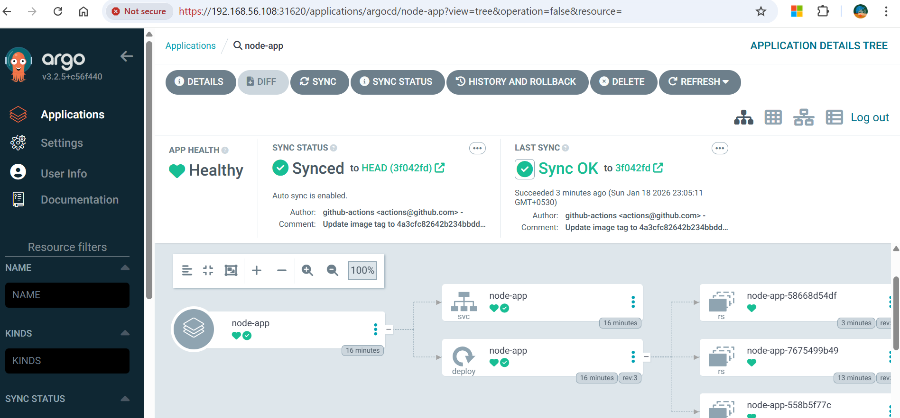
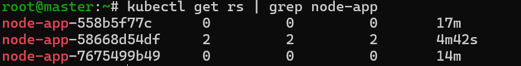
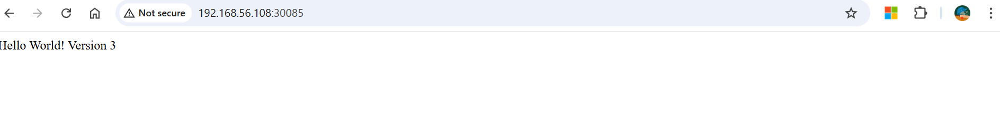

# 🚀 Kubernetes Node.js Application with GitOps CI/CD

A **learning project** demonstrating a complete GitOps workflow on **Kubernetes**, showcasing:

- Containerizing a simple Node.js app with Docker
- Automating builds & pushes using **GitHub Actions**
- Updating Kubernetes manifests in a separate repo
- Continuous deployment with **ArgoCD**

---

## 📌 Overview

This project walks through the modern GitOps pipeline:

1. **App Development** – A simple Node.js app (`Hello World! Version X`)
2. **Dockerization** – Build and publish images to DockerHub
3. **CI/CD Workflow** – GitHub Actions updates the image tag in a manifests repo
4. **GitOps Deployment** – ArgoCD syncs manifests and deploys to Kubernetes
5. **Validation** – Service exposed via NodePort, accessible externally

---

## 🧱 Workflow Components

### 🔹 Application
- **Node.js App** – Simple Express server returning versioned output

### 🔹 CI/CD
- **DockerHub** – Stores built images
- **GitHub Actions** – Automates build, push, and manifest updates

### 🔹 GitOps
- **Manifests Repo** – Contains `deployment.yaml` and `service.yaml`
- **ArgoCD** – Watches manifests repo, syncs changes to cluster

---

## 🛠 Technology Stack
**Kubernetes · Docker · Node.js · GitHub Actions · ArgoCD**

---

## 👨‍💻 Author
**Chandrakanth Reddy**

⭐ **Star this repo if you find it useful!**

---

## 📸 Application Screenshots

### ArgoCD UI
Shows the synced application deployment.


### ReplicaSets
Demonstrates rolling update: new ReplicaSet pods running, old ReplicaSet scaled to zero.


### Node.js App Output
Application response after deployment: **Hello World! Version 3**


---

## 🧭 Workflow Diagram

```mermaid
flowchart LR
    Dev[Developer] --> GitHub[GitHub Repo]
    GitHub --> Actions[GitHub Actions]
    Actions --> DockerHub[(DockerHub)]
    Actions --> ManifestsRepo[Manifests Repo]
    ManifestsRepo --> ArgoCD[ArgoCD Controller]
    ArgoCD --> K8sCluster[Kubernetes Cluster]
    K8sCluster --> NodePort[NodePort Service]
    NodePort --> User[User Browser]
